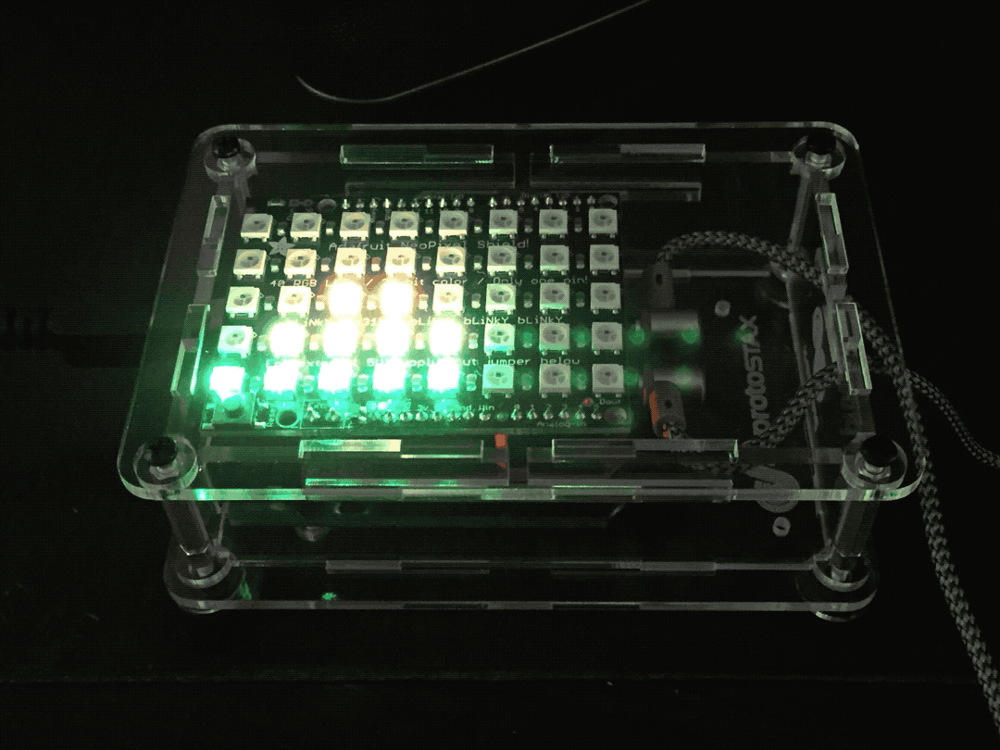

# ProtoStax_Audio_Visualizer_Demo
Demo for ProtoStax Audio Visualizer with Spectrum Shield, NeoPixel Shield and Arduino



using [ProtoStax for Arduino](https://www.protostax.com/products/protostax-for-arduino)

## Prerequisites

This demo uses
* [Adafruit NeoPixel Shield for Arduino](https://www.adafruit.com/product/1430)
* [SparkFun Spectrum Shield](https://www.sparkfun.com/products/13116)
* [ProtoStax for Arduino](https://www.protostax.com/products/protostax-for-arduino)
* Arduino (Uno), but you can use other form factors that fit a Shield

For further instructions, see the [RGB Matrix Audio Visualizer with
Arduino](https://www.hackster.io/sridhar-rajagopal/rgb-matrix-audio-visualizer-with-arduino-845062) Tutorial at [Hackster.io](https://www.hackster.io/sridhar-rajagopal/rgb-matrix-audio-visualizer-with-arduino-845062)

## Installing

This demo uses the Adafruit_NeoMatrix library - see [https://github.com/adafruit/Adafruit_NeoMatrix](https://github.com/adafruit/Adafruit_NeoMatrix)
It also uses SparkFun's Spectrum Shield and has taken notes from its
GitHub example (no separate library required) - see [https://github.com/sparkfun/Spectrum_Shield](https://github.com/sparkfun/Spectrum_Shield)

```
Arduino IDE->Sketch->Include LIbrary->Manage Libraries - choose
Adafruit_NeoMatrix and install it
git clone https://github.com/protostax/ProtoStax_Audio_Visualizer_Demo.git
```

## Usage

See instructions in Tutorial linked above for putting together shields and
enclosure. 

```
open
ProtoStax_Audio_Visualizer_Demo/ProtoStax_Audio_Visualizer_Demo.ino in
Arduino IDE
compile sketch and upload to your Arduino
```

## License

Written by Sridhar Rajagopal for ProtoStax. BSD license, all text above must be included in any redistribution

A lot of time and effort has gone into providing this and other code. Please support ProtoStax by purchasing products from us!
Also uses the Adafruit NeoPixel Shield for Arduino and
Adafruit_NeoMatrix library. Please support Adafruit by purchasing products from them!
Also uses the SparkFun Spectrum Shield. Please support SparkFun by
purchasing products from them! 


